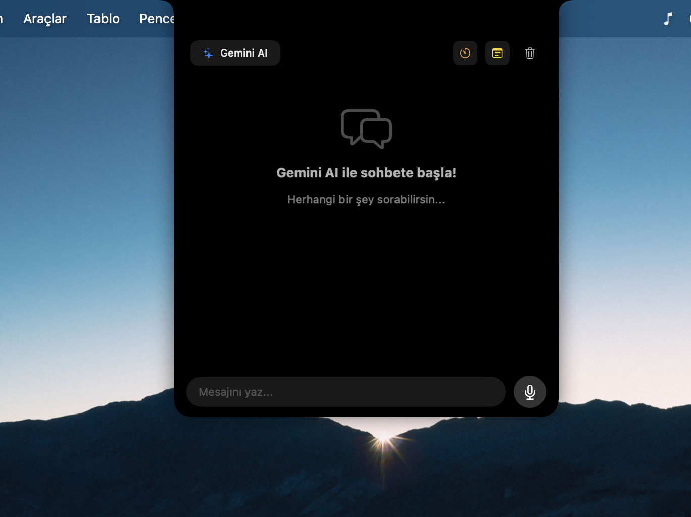
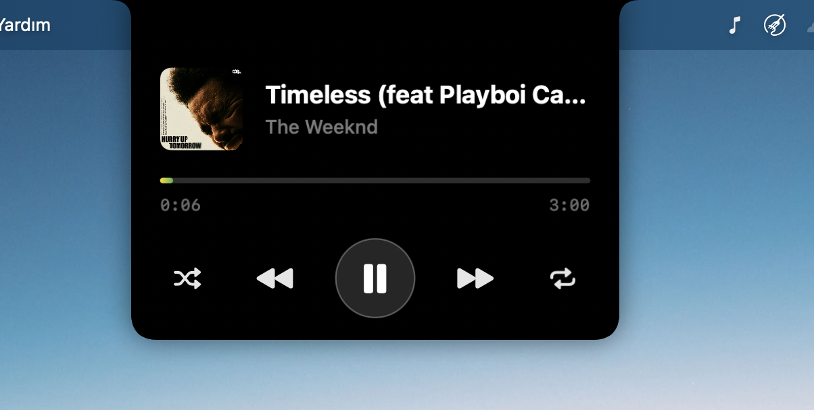
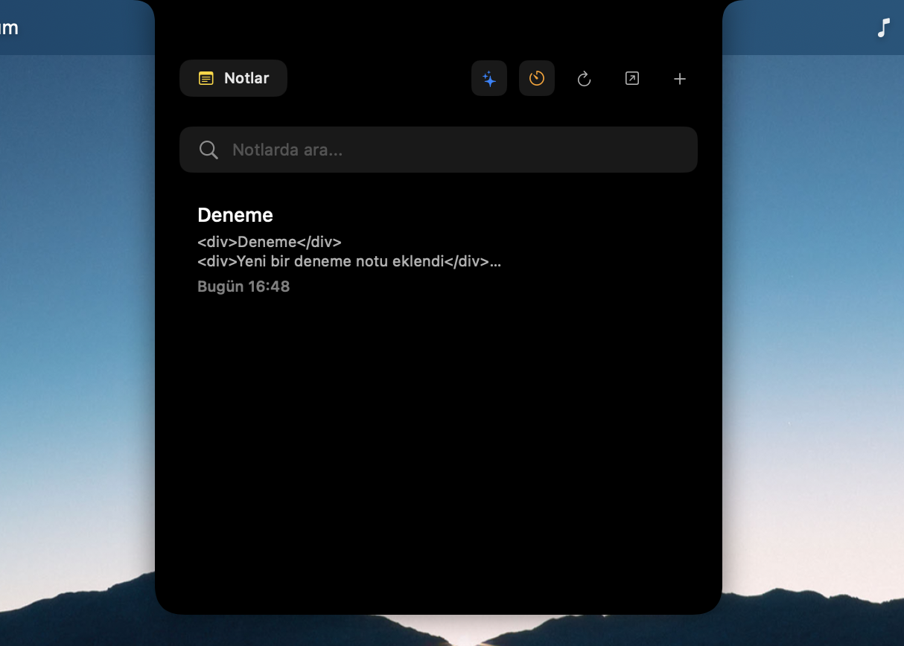
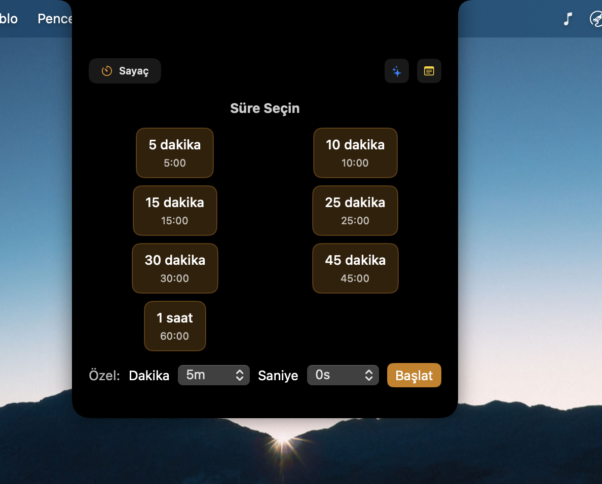
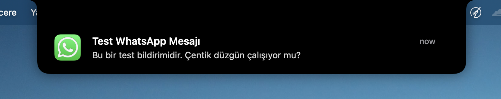

# NotchApp

<h1 align="center">NotchApp</h1>

<p align="center">
  <strong>MacBook çentiğinizi, macOS deneyiminizin merkezinde yer alan akıllı, dinamik ve interaktif bir asistana dönüştürün.</strong>
</p>

<p align="center">
  <a href="#-derinlemesine-özellikler">Özellikler</a> •
  <a href="#-mimari-ve-teknik-yapı">Teknik Yapı</a> •
  <a href="#-kurulum-ve-başlarken">Kurulum</a>
</p>

---

## Neden NotchApp?

MacBook'lardaki çentik alanı genellikle fiziksel bir çentik alanı olarak durur. NotchApp, bu alanı yeniden hayal ederek, onu sadece estetik bir unsur olmaktan çıkarıp, günlük iş akışlarınızı hızlandıran ve bağlamsal bilgi sunan üretken bir araca dönüştürür. Apple'ın "Dynamic Island" felsefesinden ilham alarak, bu güçlü konsepti macOS'e taşıyoruz. Rakiplerinden ayrılmış en güçlü özelliği ise çentikte bulunan bir yapay zeka yardımıyla kullanıcıların yapay zekayla etkileşim içine girmesidir.

## ⚙️ Derinlemesine Özellikler

NotchApp, her biri özenle tasarlanmış modüler özellikler sunar:

### 🤖 Gemini AI Asistanı
- **Teknoloji:** Google'ın yapay zekası olan **Gemini** modelini temel alır.
- **İşlevsellik:** Sadece soru sormakla kalmaz, aynı zamanda sohbet geçmişini de dikkate alarak bağlamsal ve tutarlı yanıtlar üretir. Kod parçacıkları oluşturun, metinleri özetleyin veya hızlıca beyin fırtınası yapın.
- **Entegrasyon:** `URLSession` ve modern `async/await` kullanılarak verimli bir API iletişimi sağlanır.
<p align="center">
  
</p>

### 🎵 Akıllı Medya Kontrol Merkezi
- **Verimlilik:** "Sıfır Yoklama" (Zero-Polling) prensibiyle çalışır. Sürekli sorgulama yapmak yerine, `MPRemoteCommandCenter` ve `NotificationCenter` üzerinden gelen anlık sistem bildirimlerini dinleyerek CPU kullanımını ve enerji tüketimini minimumda tutar.
- **Uyumluluk:** Sistem genelindeki medya oynatıcılarla çalışırken, özellikle **Spotify**'ın yaşam döngüsü (başlatma/kapatma) için özel optimizasyonlar içerir.
- **Görsellik:** Çalan parçanın albüm kapağını ve bilgilerini zarif bir arayüzde sunar.
<p align="center">
  
</p>

### 📝 Apple Notes Entegrasyonu
- **Derin Entegrasyon:** macOS'in yerel **Notlar (Notes)** uygulamasıyla doğrudan senkronize olur. Bu, sadece uygulama içi bir not defteri değil, mevcut tüm notlarınıza erişim, onları düzenleme ve yenilerini oluşturma imkanı sunar.
- **Teknoloji:** Arka planda güçlü ve güvenli **AppleScript** köprüleri çalıştırarak Notlar veritabanıyla iletişim kurar.
- **Performans:** Sık erişimleri hızlandırmak için akıllı bir önbellekleme (caching) mekanizması içerir, böylece Notlar uygulaması her seferinde yeniden sorgulanmaz.
<p align="center">
  
</p>

### Diğer Güçlü Özellikler
- **Ses Kontrolü:** Çentik alanını interaktif bir ses göstergesine dönüştürür.
- **Zamanlayıcı:** Hızlı ve erişilebilir zamanlayıcılar kurun.
<p align="center">
  
</p>

- **Bildirim Merkezi:** Uygulama bildirimlerinizi modern ve dikkat dağıtmayan bir arayüzde toplar. Örneğin Whatsapp,Mail gibi uygulamalardan gelen bildirimler de bir çentikte belirir ve kullanıcıya güzel bir deneyim sunar.

<p align="center">
  
</p>

---

## 🏗️ Mimari ve Teknik Yapı

NotchApp, performans, esneklik ve modern Swift özelliklerini bir araya getiren katmanlı bir mimari üzerine inşa edilmiştir.

### Çekirdek: `DynamicNotchKit`
Uygulamanın kalbi, projeyle birlikte geliştirilen yerel bir Swift Paketi olan `DynamicNotchKit`'tir. Bu kütüphane, çentik etrafındaki kullanıcı arayüzünü yönetmekten sorumludur.
- **Durum Yönetimi (State Management):** Arayüzün `.expanded` (genişletilmiş) ve `.compact` (kompakt) olmak üzere iki ana durumu bulunur. Bu durumlar arasındaki geçişler, akıcı ve özelleştirilebilir animasyonlarla yönetilir.
- **Pencereleme (Windowing):** Standart pencereler yerine, yüksek düzeyde özelleştirilebilen ve sistemin üzerinde süzülen bir `NSPanel` kullanır. Bu, uygulamanın diğer pencerelerle ve menü çubuğuyla sorunsuz bir şekilde etkileşime girmesini sağlar.
- **Asenkron Kontrol:** Tüm `show`, `hide`, `expand`, `compact` gibi arayüz komutları, Swift'in modern `async/await` sözdizimi kullanılarak kontrol edilir. Bu, karmaşık animasyon zincirlerinin temiz ve okunabilir bir şekilde yazılmasına olanak tanır.

### Uygulama Akışı
Uygulama akışı; kullanıcı etkileşimleri, sistem bildirimleri, durum güncellemeleri ve arayüz yenilemelerini içerir. Kullanıcı uygulamayla etkileşime girdiğinde (örneğin medya oynatmayı başlattığında), bir sistem bildirimi tetiklenir. İlgili denetleyici (`MediaController` gibi) bu bildirimi işleyerek kendi durumunu günceller. Bu durum güncellemesi, SwiftUI arayüzünün yeniden çizilmesini tetikler ve arayüz de `DynamicNotchKit` ile iletişim kurarak çentiği genişletir veya daraltır.

---

## 🛠️ Kurulum ve Başlarken

Projeyi yerel makinenizde çalıştırmak için:

1.  **Repoyu Klonlayın:**
    ```bash
    git clone https://github.com/ardagnr/notch_app.git
    cd notch_app
    ```

2.  **Projeyi Xcode'da Açın:**
    `Package.swift` dosyasına çift tıklayarak veya terminalden `xed .` komutunu kullanarak projeyi Xcode'da açın.

3.  **Sistem İzinlerini Yapılandırın:**
    - **Erişilebilirlik (Accessibility):** Medya tuşlarını dinlemek ve diğer uygulamalarla etkileşim için gereklidir.
    - **Otomasyon (Automation):** AppleScript'in Notlar uygulamasını kontrol edebilmesi için gereklidir. Uygulama ilk çalıştığında sistem sizden bu izinleri isteyecektir. `Sistem Ayarları > Gizlilik ve Güvenlik > Otomasyon` bölümünden NotchApp'e Notlar için izin verdiğinizden emin olun.

4.  **(Opsiyonel) Gemini API Anahtarını Ayarlayın:**
    Gemini özelliğini kullanmak için API anahtarınızı bir ortam değişkeni olarak tanımlamanız gerekir. Bu, anahtarınızın güvenliğini sağlar.

    Terminalde şu komutu çalıştırın (`"YOUR_API_KEY_HERE"` kısmını kendi anahtarınızla değiştirin):
    ```bash
    export GEMINI_API_KEY="YOUR_API_KEY_HERE"
    ```
    Bu ayarı kalıcı hale getirmek için `~/.zshrc` veya `~/.bash_profile` dosyanıza eklemeniz önerilir.

5.  **Çalıştırın:**
    Xcode'da `Product > Run` (`Cmd+R`).

---
